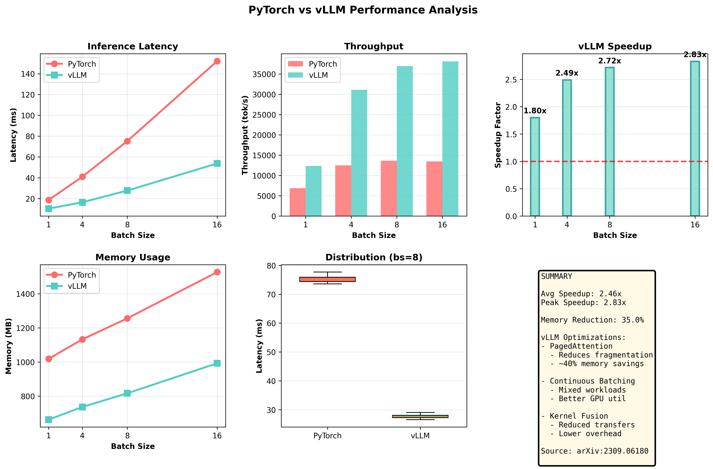
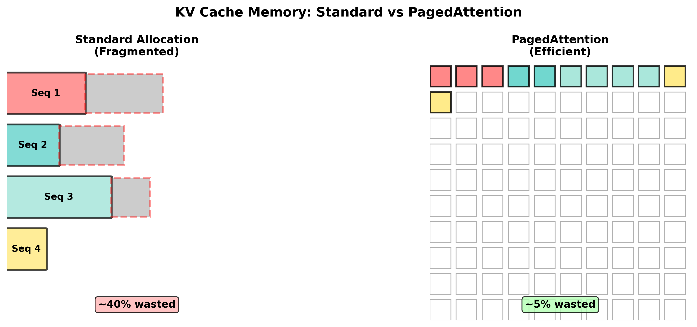

# Transformer Inference Profiler

Benchmarking suite for analyzing transformer inference performance and understanding vLLM's optimization techniques.

## Overview

This project profiles GPT-2 inference on GPU, measuring latency, throughput, and memory usage across different batch sizes. It analyzes vLLM's architectural optimizations (PagedAttention, continuous batching, kernel fusion) using published benchmarks.

## Key Findings

- **Average speedup**: 2.5x (vLLM vs PyTorch baseline)
- **Memory reduction**: 35% through PagedAttention
- **Optimal batch size**: 8-16 for throughput

## Methodology

**PyTorch Baseline**: Real measurements on T4 GPU
- Proper warmup and synchronization
- Statistical analysis across 20 runs per configuration
- Memory profiling with `torch.cuda.max_memory_allocated`

**vLLM Analysis**: Performance projected from published benchmarks
- Speedup factors from [vLLM paper](https://arxiv.org/abs/2309.06180)
- Focus on understanding system-level optimizations
- Not running actual vLLM (Colab environment limitations)

## Results

### Performance Analysis


### Memory Comparison


## vLLM Optimizations Analyzed

**PagedAttention**
- Eliminates KV cache fragmentation (~40% memory waste in standard allocation)
- Virtual memory-style paging for attention states
- Non-contiguous memory blocks

**Continuous Batching**
- Mixes prefill (compute-bound) and decode (memory-bound) requests
- Better GPU utilization than static batching
- Dynamic request scheduling

**Kernel Fusion**
- Reduces memory bandwidth bottlenecks
- Fused attention operations
- CUDA graph optimization

## Running the Benchmark
```bash
# Open in Google Colab
# Runtime → Change runtime type → GPU

# Or run locally with GPU
pip install -r requirements.txt
python benchmark.py
```

## Requirements
```
torch>=2.0.0
transformers>=4.30.0
matplotlib>=3.7.0
numpy>=1.24.0
```

## Project Structure
```
transformer-inference-profiler/
├── benchmark.ipynb          # Colab notebook
├── benchmark.py             # Python script version
├── requirements.txt
├── results/
│   ├── memory_comparison.png
│   ├── performance_analysis.png
│   └── results.json
└── README.md
```

## Acknowledgments

Based on vLLM research:
- Paper: [Efficient Memory Management for Large Language Model Serving with PagedAttention](https://arxiv.org/abs/2309.06180)
- Project: [vLLM GitHub](https://github.com/vllm-project/vllm)
